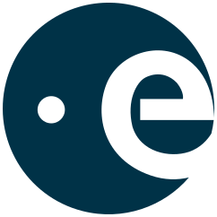
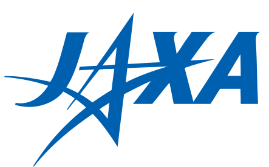

<div align="center">
  
  <h1>Stargazer</h1>
  <p><em>A clearer view of space.</em></p>
  <p>
    Space data is scattered across dozens of government APIs, academic databases, and mission pages. Stargazer brings it all together into one beautiful, interactive 3D view. Live telemetry, real positions, and a design that gets out of the way so you can explore.
  </p>
</div>

---

## Why Stargazer

Space is endlessly fascinating, but the data that describes it is fragmented and hard to access. Want to know where the ISS is right now? One API. Where Voyager 1 is? A different database. What Jupiter's moons are doing? Yet another. Stargazer pulls all of these sources into a single 3D scene that you can fly through, click on anything, and learn from. Free, no accounts, runs in any modern browser.

We're designers who love space, not astronomers. But we care deeply about getting the details right, so every position in Stargazer is backed by published data from NASA, JPL, ESA, and other public sources. Where we make visual trade-offs (like making planets bigger so you can actually see them), we show you the real numbers in the info panels.

---

## What's tracked

The whole solar system, all in one unified scene:

| Category | Count | Examples |
|---|---|---|
| **Star** | 1 | Sun |
| **Planets** | 8 | Mercury through Neptune |
| **Dwarf planets** | 7 | Pluto, Ceres, Eris, Haumea, Makemake, Sedna, Quaoar |
| **Moons** | 21 | Earth's Moon, Phobos, Deimos, Io, Europa, Ganymede, Callisto, Titan, Enceladus, Triton, Charon, and more |
| **Asteroids** | 10 | Vesta, Pallas, Hygiea, 16 Psyche, Eros, Bennu, Ryugu, Itokawa, Didymos, Apophis |
| **Comets** | 3 | Halley, 67P/Churyumov-Gerasimenko, Tempel 1 |
| **Earth satellites** | 14 | ISS, Tiangong, Hubble, Chandra, Fermi, GOES-18, NOAA-20, GPS, Starlink, and more |
| **Spacecraft** | 18 | JWST, Voyager 1/2, Juno, Parker Solar Probe, Curiosity, Perseverance, New Horizons, and more |

Every body has a facts panel with cited sources and a tracking badge showing whether its position is live or a snapshot.

---

## Features

### Explore the solar system

- **The entire solar system** in a unified 3D heliocentric scene
- **Click anything** to fly to it, see its info, and explore its neighborhood
- **Cinematic camera** that adapts its speed and arc to the distance traveled
- **Hover any dot** to see what it is; click to select and learn more
- **Selection reticle** frames whatever you're focused on
- **Orbit highlighting** dims everything except the selected body's path

### Watch things move

- **Time control** with pause, fast-forward (up to 1 year per second), and reverse
- **Custom date picker** that works the same on every browser
- **Timeline slider** spanning 100 years of scrubbing range
- **Trajectory trails** that show where each body has recently been
- **Planet rotation** on real axes (Earth tilted 23.4 degrees, Uranus on its side, Pluto upside down)
- **Comet tail indicators** pointing away from the Sun

### Live tracking

- **ISS position** updated every second from live telemetry
- **Tiangong** tracked via SGP4 propagation from NORAD data
- **12 curated Earth-orbit satellites** (Hubble, Chandra, Fermi, GOES-18, GPS, Starlink, and more) with live orbital positions from Celestrak
- **Crew aboard** the ISS and Tiangong, updated live
- **Pass predictor** tells you when the ISS will fly over your location

### Rich info panels

- Dedicated panels for Earth, Moon, Mars, ISS, Tiangong, and the Solar System overview
- Every other body gets an auto-generated panel with facts, description, live distance, tracking source, and cited references
- Quick-jump strip for fast navigation between planets and famous missions
- Type filters and search across the entire registry

### Visual details

- Atmosphere shells on Earth, Venus, and Titan
- Saturn's rings at the correct radii, sitting in Saturn's tilted equatorial plane
- Sun bloom glow visible from solar system zoom
- Ecliptic plane grid for orbital inclination reference
- 16 famous star labels (Sirius, Vega, Polaris, etc.) for celestial orientation
- Orbit thickness that tapers from inner to outer planets

---

## Under the hood

Stargazer uses published astronomical data for all of its positions. Here's the short version of how it works:

1. **Planet positions** come from the Standish/Meeus ephemeris, the same fit behind NASA's "Approximate Positions of the Planets" tables.
2. **Moon, asteroid, and comet orbits** are propagated from Keplerian elements pulled from JPL HORIZONS.
3. **Earth-orbit satellites** use NORAD TLE data from Celestrak, propagated client-side with SGP4.
4. **The ISS** is polled live from wheretheiss.at at 1 Hz.
5. **Lighting** follows real solar geometry, so the day/night terminator and Moon phase match what's outside your window.

A few visual compromises keep the scene readable: planet bodies are exaggerated so they're visible at interplanetary scale, the Moon's distance is compressed so it doesn't float halfway to Mars, and satellite altitudes are compressed so GEO birds don't appear further from Earth than the Moon. The real physical numbers are always shown in the info panels.

---

## Data sources

<div align="center">
  &nbsp;&nbsp;&nbsp;&nbsp;
  &nbsp;&nbsp;&nbsp;&nbsp;
  &nbsp;&nbsp;&nbsp;&nbsp;
  &nbsp;&nbsp;&nbsp;&nbsp;
  
</div>

<br />

Stargazer aggregates from free, public data sources. We are **not affiliated with** any space agency or company listed here. We're fans building on top of public data.

| Source | What it provides |
|---|---|
| **[JPL HORIZONS](https://ssd.jpl.nasa.gov/horizons/)** | Orbital elements for moons, asteroids, comets, and spacecraft |
| **[JPL Small-Body Database](https://ssd.jpl.nasa.gov/tools/sbdb_lookup.html)** | Reference data for asteroids, comets, and dwarf planets |
| **[NASA Planetary Fact Sheets](https://nssdc.gsfc.nasa.gov/planetary/factsheet/)** | Planet mass, gravity, temperature, atmosphere data |
| **[NASA Visible Earth](https://visibleearth.nasa.gov/)** | Earth and Moon photographic textures |
| **[Solar System Scope](https://www.solarsystemscope.com/textures/)** | Planet texture maps (Mercury through Neptune, Saturn's rings). [CC BY 4.0](https://creativecommons.org/licenses/by/4.0/) |
| **[Celestrak](https://celestrak.org/)** | NORAD TLE sets for ISS, Tiangong, and 12 curated satellites |
| **[wheretheiss.at](https://wheretheiss.at/)** | Live ISS position, velocity, altitude, and visibility |
| **[open-notify.org](http://open-notify.org/)** | Humans currently in space, by craft |
| **BigDataCloud** | Reverse geocoding for satellite sub-point locations |
| **[satellite.js](https://github.com/shashwatak/satellite-js)** | SGP4 orbit propagation (MIT) |
| **NASA TV (YouTube)** | Embedded live broadcast |

All API requests involving keys are proxied server-side so credentials never reach the browser.

---

## Tech stack

| | |
|---|---|
| Framework | [SvelteKit](https://kit.svelte.dev) (Svelte 5 with runes) |
| 3D rendering | [Threlte 8](https://threlte.xyz) (Three.js wrapper for Svelte) |
| Satellite math | [satellite.js](https://github.com/shashwatak/satellite-js) (SGP4 propagator) |
| Styling | [Tailwind CSS](https://tailwindcss.com) + CSS variables |
| Hosting | [Vercel](https://vercel.com) (`@sveltejs/adapter-vercel`) |

---

## Getting started

```bash
# 1. Install dependencies
npm install

# 2. Set up env vars
cp .env.example .env
#   then open .env and paste your free NASA key from https://api.nasa.gov

# 3. Start the dev server
npm run dev
```

Then open <http://localhost:5174>.

### Configuration

| Variable | Required | Description |
|---|---|---|
| `NASA_API_KEY` | yes | Free key from <https://api.nasa.gov>. Server-side only. Proxied through `/api/nasa/[...path]`. |
| `PUBLIC_KOFI_USERNAME` | no | Ko-fi username for the support button. Leave blank to hide. |

---

## Project layout

```
src/
├── app.css                          # Design tokens, surface system
├── lib/
│   ├── scene-config.ts              # Scale constants, compression factors
│   ├── registry/
│   │   ├── types.ts                 # TrackedObject, metadata types
│   │   ├── registry.ts              # Central body array, getById, getWorldPosition
│   │   └── bodies/                  # One file per body group
│   ├── components/
│   │   ├── scene/                   # 3D components (Threlte Canvas)
│   │   ├── layout/                  # UI overlay panels
│   │   └── ui/                      # Reusable primitives (DatePicker, InfoTooltip)
│   ├── stores/                      # Svelte stores (simTime, selection, satellite data)
│   ├── utils/                       # Ephemeris, coordinate math, click detection
│   └── server/                      # Server-only API proxies
└── routes/
    ├── +page.svelte                 # Landing page
    ├── app/+page.svelte             # Main 3D app
    └── api/                         # Proxy endpoints (ISS, TLE, geocode, NASA)
```

---

## Contributing

PRs welcome. Two things we care about:

1. **Match the existing patterns.** Run `npm run format` before submitting. Follow the registry pattern for new bodies.
2. **Keep the data honest.** Positions should come from published sources. Visual compromises are fine as long as the real numbers are shown in the UI.

---

## License

MIT. See [LICENSE](./LICENSE).

---

## Credits

Powered by [The Lab](https://lab.ordinarycompany.design/).

Planet textures from NASA Visible Earth and [Solar System Scope](https://www.solarsystemscope.com/textures/) (CC BY 4.0). Orbital data from [JPL HORIZONS](https://ssd.jpl.nasa.gov/horizons/). Satellite propagation by [satellite.js](https://github.com/shashwatak/satellite-js). Agency logos from Wikimedia Commons.

Stargazer is **not affiliated with** NASA, ESA, JAXA, SpaceX, or any other space agency or company. We are fans who think this data deserves a better home.
